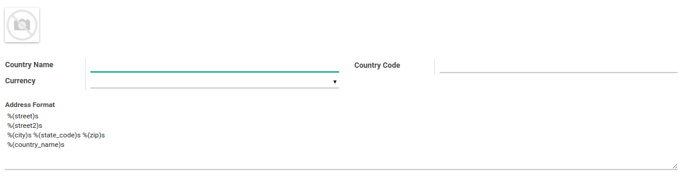

# Negara

### <a name="bagian-negara">HEADER</a>

#### <a name="field-name">Country Name</a>

Nama negara

#### <a name="field-code">Country Code</a>

Kode negara

#### <a name="field-currency-id">Currency</a>

Mata uang negara

#### <a name="field-address-format">Address Layout</a>

Format tampilan untuk alamat yang akan digunakan.
