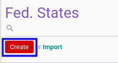

# Membuat Data Propinsi

## A. INPUT

*(Tidak ada instruksi khusus)*

## B. LANGKAH KERJA

1. Buka menu **Partner -> Configuration -> Address Book -> Localization -> Fed. States**. Abaikan jika sudah berada pada menu yang dimaksud.
2. Klik tombol **Create** pada bagian atas-kiri form.

3. Isi **[State Name](./penjelasan.md#field-name)**. Harus diisi.
4. Isi **[State Code](./penjelasan.md#field-code)**. Harus diisi.
5. Pilih **[Country](./penjelasan.md#field-country-id)**. Harus diisi.
6. Isi **[ZIP](./penjelasan.md#field-zip-name)**. Tidak harus diisi.
7. Isi **[City Code](./penjelasan.md#field-zip-city-code)**. Tidak harus diisi.
8. Isi **[City](./penjelasan.md#field-zip-city)**. Tidak harus diisi.
9. Pilih **[Country](./penjelasan.md#field-zip-country-id)**. Tidak harus diisi.
10. Klik tombol **Save** pada bagian atas-kiri form.

## C. OUTPUT

* Data propinsi akan terbuat.
