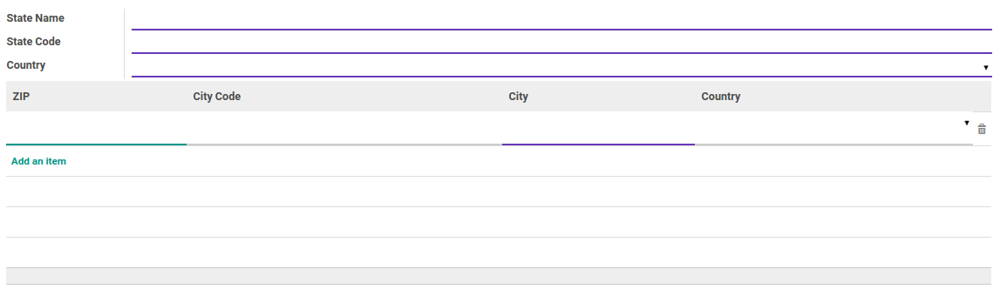

# Propinsi

### <a name="bagian-header">HEADER</a>

#### <a name="field-name">State Name</a>

Nama propinsi

#### <a name="field-code">State Code</a>

Kode propinsi

#### <a name="field-country-id">Country</a>

Negara

#### <a name="field-zip-name">ZIP</a>

Kode Pos

#### <a name="field-zip-city-code">City Code</a>

Kode Kota

#### <a name="field-zip-city">City</a>

Kota

#### <a name="field-zip-country-id">Country</a>

Negara
