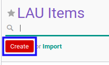

# Membuat Data Unit Administrasi

## A. INPUT

*(Tidak ada instruksi khusus)*

## B. LANGKAH KERJA

1. Buka menu **Partner -> Configuration -> Address Book -> Localization -> LAU Items**. Abaikan jika sudah berada pada menu yang dimaksud.
2. Klik tombol **Create** pada bagian atas-kiri form.

3. Isi **[Level](./penjelasan.md#field-level)**. Harus diisi.
4. Isi **[Code](./penjelasan.md#field-code)**. Harus diisi.
5. Pilih **[Parent ID](./penjelasan.md#field-parent-id)**. Tidak harus diisi.
6. Isi **[Name](./penjelasan.md#field-name)**. Harus diisi.
7. Pilih **[Country](./penjelasan.md#field-country-id)**. Harus diisi.
8. Pilih **[State](./penjelasan.md#field-state-id)**. Tidak harus diisi.
9. Klik tombol **Save** pada bagian atas-kiri form.

## C. OUTPUT

* Data unit administrasi akan terbuat.
