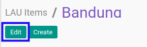
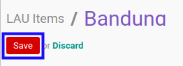

# Memodifikasi Unit Administrasi

## A. INPUT

*(Tidak ada instruksi khusus)*

## B. LANGKAH KERJA

1. Buka menu **Partner -> Configuration -> Address Book -> Localization -> LAU Items**. Abaikan jika sudah berada pada menu yang dimaksud.
2. Buka data unit administrasi yang akan dimodifikasi. Abaikan jika data sudah dibuka.
3. Klik tombol **Edit** pada bagian atas-kiri form.

4. Isi dan sesuaikan **[Level](./penjelasan.md#field-level)** jika dibutuhkan. Harus diisi.
5. Isi dan sesuaikan **[Code](./penjelasan.md#field-code)** jika dibutuhkan. Harus diisi.
6. Pilih dan sesuaikan **[Parent ID](./penjelasan.md#field-parent-id)** jika dibutuhkan. Tidak harus diisi.
7. Isi dan sesuaikan **[Name](./penjelasan.md#field-name)** jika dibutuhkan. Harus diisi.
8. Pilih dan sesuaikan **[Country](./penjelasan.md#field-country-id)** jika dibutuhkan. Harus diisi.
9. Pilih dan sesuaikan **[State](./penjelasan.md#field-state-id)** jika dibutuhkan. Tidak harus diisi.
10. Klik tombol **Save** pada bagian atas-kiri form.

## C. OUTPUT

* Data unit administrasi akan berubah sesuai dengan perubahan yang dilakukan.
