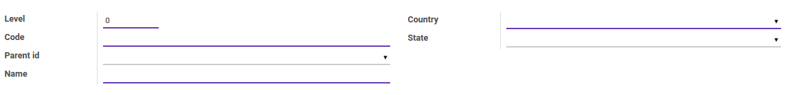

# Unit Administrasi / LAU Items

> **Catatan:** (Inggris: *Local Administrative Unit* registry disingkat LAU)

### <a name="bagian-header">HEADER</a>

#### <a name="field-level">Level</a>

Level unit administrasi

#### <a name="field-code">Code</a>

Kode unit administrasi

#### <a name="field-parent-id">Parent</a>

Parent/induk unit administrasi

#### <a name="field-name">Name</a>

Nama unit administrasi

#### <a name="field-country-id">Country</a>

Mendefinisikan negara unit adminstrasi

#### <a name="field-state-id">State</a>

Mendefinisikan propinsi unit adminstrasi
