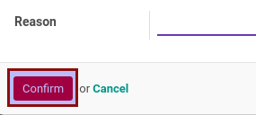

# Membatalkan Partner Evaluation

## A. INPUT

* Data partner evaluation yang akan dibatalkan harus memiliki status selain **Cancelled**.

* Checklist **[Can Cancel](./penjelasan.md#field-can-cancel)** pada tab **[Policies](./penjelasan.md#tab-policies)** harus berada pada kondisi aktif.

## B. INSTRUKSI KERJA

1. Buka menu **Partner -> Partner Evaluation -> Partner Evaluations**. Abaikan jika sudah berada pada menu yang dimaksud.
2. Buka data partner evaluation yang akan dibatalkan. Abaikan jika data sudah dibuka.
3. Klik tombol **Cancel** pada bagian atas-kiri form.

4. Klik tombol **Ok** pada pop-up konfirmasi yang muncul.

Pop-up form **Cancellation Reason** akan muncul

5. Pilih **Reason**. Harus diisi.
6. Klik tombol **Confirm** pada bagian bawah-kiri pop-up form **Cancellation Reason**.

7. Klik tombol **Ok** pada pop-up konfirmasi yang muncul.

## C. OUTPUT

* Status partner evaluation akan berubah menjadi **Cancelled**.

* Isian **[Cancellation](./penjelasan.md#field-cancellation)** akan terisi dengan user yang membatalkan dan waktu pembatalan (sesuai dengan waktu server).
* Isian **[Cancel Reason](./penjelasan.md#field-cancel-reason)** akan terisi alasan pembatalan yang dipilih pada langkah ke-5
