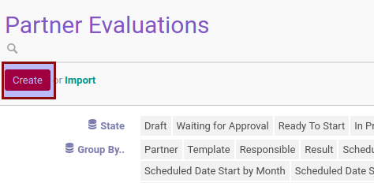
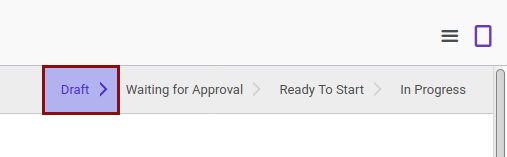

# Membuat Partner Evaluation

## A. INPUT

*(Tidak ada instruksi khusus)*

## B. INSTRUKSI KERJA

1. Buka menu **Partner -> Partner Evaluation -> Partner Evaluation**. Abaikan jika sudah berada pada menu yang dimaksud.
2. Klik tombol **Create** pada bagian atas-kiri form

3. Ubah **[# Document](./penjelasan.md#field-document)** jika diperlukan. Harus diisi.
4. Pilih **[Template](./penjelasan.md#field-template)**. Harus diisi.
5. Pilih **[Partner](./penjelasan.md#field-partner)**. Harus diisi.
6. Ubah **[Responsible](./penjelasan.md#field-responsible)** jika diperlukan. Harus diisi.
7. Isi **[Date Start](./penjelasan.md#field-date-start)**. Harus diisi tergantung dari isian **Template**.
8. Isi **[Date End](./penjelasan.md#field-date-end)**. Harus diisi tergantung dari isian **Template**.
9. Isi **[Evaluation Schedule Date Start](./penjelasan.md#field-schedule-date-start)**. Harus diisi.
10. Isi **[Evaluation Schedule Date End](./penjelasan.md#field-schedule-date-end)**. Harus diisi.
11. Buka tab **[Notes](./penjelasan.md#tab-notes)**
12. Isi **[Note](./penjelasan.md#field-notes)**. Tidak harus diisi.
13. Klik tombol **Save** pada bagian atas-kiri form.

## C. OUTPUT

* Data partner evaluation akan terbuat dengan status **Draft**.

