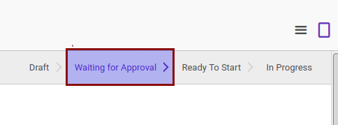
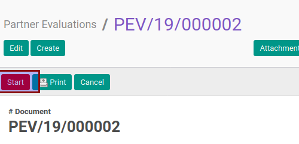
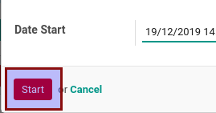

# Memulai Partner Evaluation

* Data partner evaluation yang akan disetujui harus memiliki status **Ready to Start**.

* Checklist **[Can Start](./penjelasan.md#field-can-start)** pada tab **[Policies](./penjelasan.md#tab-policies)** harus berada pada kondisi aktif.

## B. INSTRUKSI KERJA

1. Buka menu **Partner -> Partner Evaluation -> Partner Evaluations**. Abaikan jika sudah berada pada menu yang dimaksud.
2. Buka data partner evaluation yang akan disetujui. Abaikan jika data sudah dibuka.
3. Klik tombol **Start** pada bagian atas-kiri form.

4. Klik tombol **Ok** pada pop-up konfirmasi yang muncul.

Pop-up form **Start Evaluation** akan muncul

5. Isi **Date Start**. Harus diisi.
6. Klik tombol **Start** pada bagian bawah-kiri pop-up form **Start Evaluation**

## C. OUTPUT

* Status partner evaluation akan berubah menjadi **In Progress**.

* Isian **Real Date Start** akan berubah sesuai dengan nilai yang diinput pada langkah ke-5
* Isian **[Start](./penjelasan.md#field-start)** akan terisi dengan user yang memulai dan waktu mulai (sesuai dengan waktu server).
