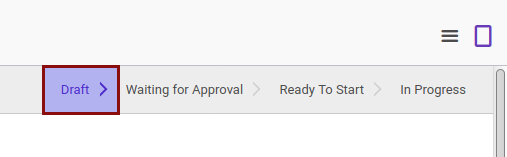

# Mengedit Partner Evaluation

## A. INPUT

* Data partner evaluation yang akan dikonfirmasi harus memiliki status **Draft**.

## B. INSTRUKSI KERJA

1. Buka menu **Partner -> Partner Evaluation -> Partner Evaluation**. Abaikan jika sudah berada pada menu yang dimaksud.
2. Buka data partner evaluation yang akan diedit. Abaikan jika data sudah dibuka.
3. Klik tombol **Edit** pada bagian atas-kiri form

4. Ubah **[# Document](./penjelasan.md#field-document)** jika diperlukan. Harus diisi.
5. Pilih dan sesuaikan **[Template](./penjelasan.md#field-template)** jika dibutuhkan. Harus diisi.
6. Pilih dan sesuaikan **[Partner](./penjelasan.md#field-partner)** jika dibutuhkan. Harus diisi.
7. Ubah **[Responsible](./penjelasan.md#field-responsible)** jika dibutuhkan. Harus diisi.
8. Isi dan sesuaikan **[Date Start](./penjelasan.md#field-date-start)** jika dibutuhkan. Harus diisi tergantung dari isian **Template**.
9. Isi dan sesuaikan **[Date End](./penjelasan.md#field-date-end)** jika dibutuhkan. Harus diisi tergantung dari isian **Template**.
10. Isi dan sesuaikan **[Evaluation Schedule Date Start](./penjelasan.md#field-schedule-date-start)** jika dibutuhkan. Harus diisi.
11. Isi dan sesuaikan **[Evaluation Schedule Date End](./penjelasan.md#field-schedule-date-end)** jika dibutuhkan. Harus diisi.
12. Buka tab **[Notes](./penjelasan.md#tab-notes)**
13. Isi dan sesuaikan **[Note](./penjelasan.md#field-notes)** jika dibutuhkan. Tidak harus diisi.
14. Klik tombol **Save** pada bagian atas-kiri form.

## C. OUTPUT

* Data partner evaluation berubah sesuai dengan perubahan yang dilakukan
