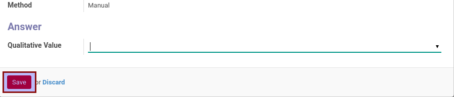

# Mengisi Jawaban Item Evaluasi Quantitative

*(Instruksi kerja ini merupakan sub instruksi dari [Mengisi Partner Evaluation](./mengisi.md). Instruksi kerja ini tidak bisa berdiri sendiri)*

## A. INPUT

*(Tidak ada instruksi khusus)*

## B. LANGKAH KERJA

1. Buka data item evaluasi pada tabel **[Measurement Items](./penjelasan.md#tabel-measurement-items)** yang akan diisi jawabannya.

Pop-up form **Open: Items** akan muncul.

2. Pilih **Quantitative Value**. Harus diisi.
3. Klik tombol **Save** pada bagian bawah-kiri pop-up form **Open: Items**

11. Lanjutkan instruksi kerja **Mengisi Partner Evaluation** [langkah ke-4](./mengisi.md#langkah-4)

## C. OUTPUT

*(Tidak ada instruksi khusus)*
