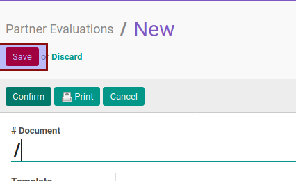

# Mengisi Penilaian Partner Evaluation

* Data partner evaluation yang akan diisi penilaiannya harus memiliki status **In Progress**.

## B. INSTRUKSI KERJA

1. Buka menu **Partner -> Partner Evaluation -> Partner Evaluations**. Abaikan jika sudah berada pada menu yang dimaksud.
2. Buka data partner evaluation yang akan diisi penilaiannya. Abaikan jika data sudah dibuka.
3. Buka tab [Measurement Items](./penjelasan.md#tab-measurement-items).
4. Jawab pertanyaan evaluasi tiap data item evaluasi pada tabel **[Measurement Items](./penjelasan.md#tabel-measurement-items)** dengan isian **[Method](./penjelasan.md#field-method)** == Manual. [Pilih jawaban](./memilih-jawaban-qualitative.md) apabila isian **Type** == Qualitative atau [Isi jawaban](./mengisi-jawaban-quantitative.md) jika isian **Type** == Quantitative. Ulangi sampai semua jawaban sesuai dengan keadaan.
14. Klik tombol **Save** pada bagian atas-kiri form.

## C. OUTPUT

* Tabel **[Measurement Items](./penjelasan.md#tabel-measurement-items)** akan berubah sesuai dengan perubahan yang dilakukan.
