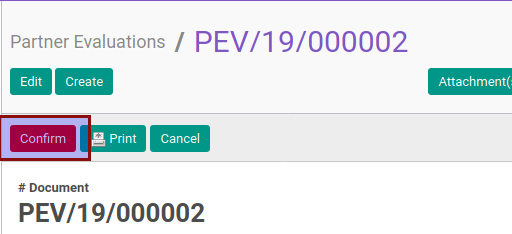

# Mengkonfirmasi Partner Evaluation

## A. INPUT

* Data partner evaluation yang akan dikonfirmasi harus memiliki status **Draft**.

* User yang mengkonfirmasi harus memiliki akses untuk mengkonfirmasi partner evaluation.

## B. INSTRUKSI KERJA

1. Buka menu **Partner -> Partner Evaluation -> Partner Evaluations**. Abaikan jika sudah berada pada menu yang dimaksud.
2. Buka data partner evaluation yang akan dikonfirmasi. Abaikan jika data sudah dibuka.
3. Klik tombol **Confirm** pada bagian atas-kiri form.

4. Klik tombol **Ok** pada pop-up konfirmasi yang muncul.

## C. OUTPUT

* Status partner evaluation akan berubah menjadi **Waiting for Approval**.

* Data partner evaluation tidak dapat dimodifikasi.
