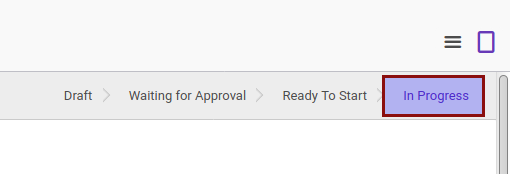
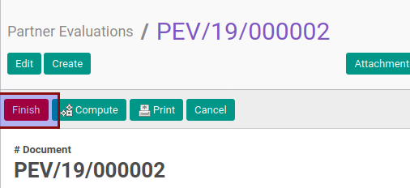
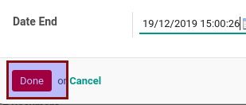
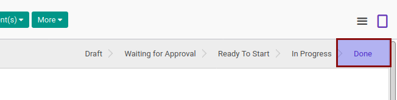

# Menyelesaikan Partner Evaluation

* Data partner evaluation yang akan diselesaikan harus memiliki status **In Progress**.

* User yang menyelesaikan harus memiliki akses untuk menyelesaikan partner evaluation.

## B. INSTRUKSI KERJA

1. Buka menu **Partner -> Partner Evaluation -> Partner Evaluations**. Abaikan jika sudah berada pada menu yang dimaksud.
2. Buka data partner evaluation yang akan diselesaikan. Abaikan jika data sudah dibuka.
3. Klik tombol **Finish** pada bagian atas-kiri form.

4. Klik tombol **Ok** pada pop-up konfirmasi yang muncul.

Pop-up form **Finish Evaluation** akan muncul

5. Isi **Date End**. Harus diisi.
6. Apabila isian **Result** tampil maka pilih **Result**. Harus diisi.
7. Klik tombol **Done** pada bagian bawah-kiri pop-up form **Finish Evaluation**

## C. OUTPUT

* Status partner evaluation akan berubah menjadi **Done**.

* Isian **Real Date End** akan berubah sesuai dengan nilai yang diinput pada langkah ke-5
* Data penilaian dengan **Method** == Automatic pada tabel **Measurement Items** akan diisi secara otomatis
* Isian **Result** akan diisi sesuai dengan (1) komputasi otomatis, atau (2) sesuai dengan nilai yang diinput pada langkah ke-6
