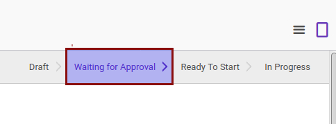

# Menyetujui Partner Evaluation

* Data partner evaluation yang akan disetujui harus memiliki status **Waiting for Approval**.

* User yang menyetujui harus memiliki akses untuk menyetujui partner evaluation.

## B. INSTRUKSI KERJA

1. Buka menu **Partner -> Partner Evaluation -> Partner Evaluations**. Abaikan jika sudah berada pada menu yang dimaksud.
2. Buka data partner evaluation yang akan disetujui. Abaikan jika data sudah dibuka.
3. Klik tombol **Approve** pada bagian atas-kiri form.

4. Klik tombol **Ok** pada pop-up konfirmasi yang muncul.

## C. OUTPUT

* Status partner evaluation akan berubah menjadi **Ready To Start**.

