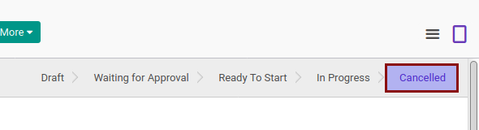
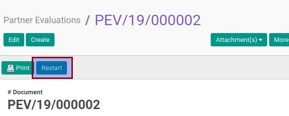

# Merestart Partner Evaluation

## A. INPUT

* Data partner evaluation yang akan direstart harus memiliki status **Cancelled**.

* Checklist **[Can Cancel](./penjelasan.md#field-can-cancel)** pada tab **[Policies](./penjelasan.md#tab-policies)** harus berada pada kondisi aktif.

## B. INSTRUKSI KERJA

1. Buka menu **Partner -> Partner Evaluation -> Partner Evaluations**. Abaikan jika sudah berada pada menu yang dimaksud.
2. Buka data partner evaluation yang akan direstart. Abaikan jika data sudah dibuka.
3. Klik tombol **Restart** pada bagian atas-kiri form.

4. Klik tombol **Ok** pada pop-up konfirmasi yang muncul.

## C. OUTPUT

* Status partner evaluation akan berubah menjadi **Draft**.

* Data partner evaluation dapat dimodifikasi kembali
* Isian **[Confirmation](./penjelasan.md#field-confirmation)** dikosongkan.
* Isian **[Approval](./penjelasan.md#field-approval)** dikosongkan.
* Isian **[Start](./penjelasan.md#field-start)** dikosongkan.
* Isian **[Finish](./penjelasan.md#field-finish)** dikosongkan.
* Isian **[Cancellation](./penjelasan.md#field-cancellation)** dikosongkan.
