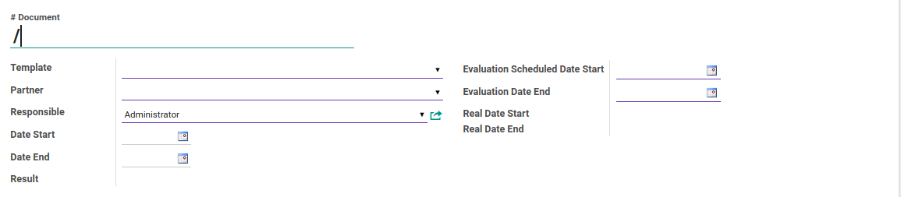
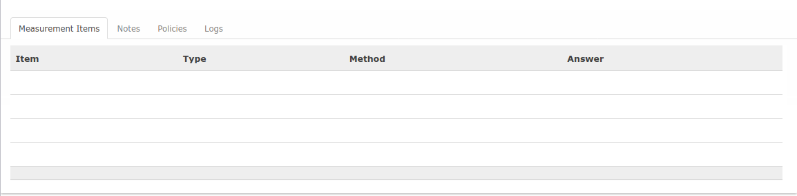
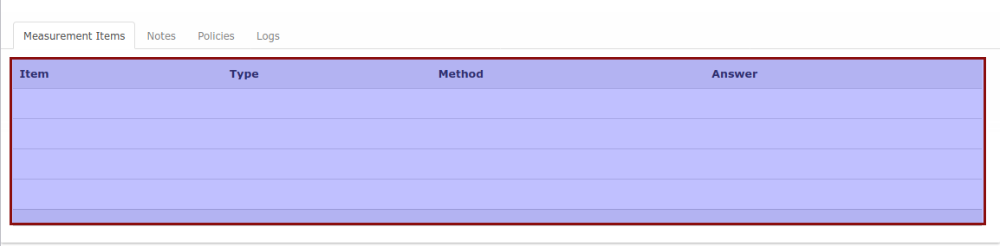
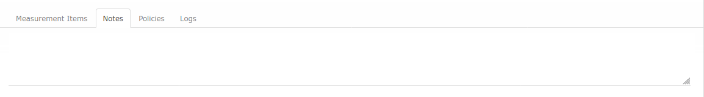
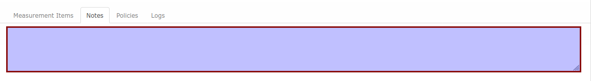
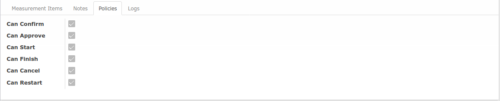
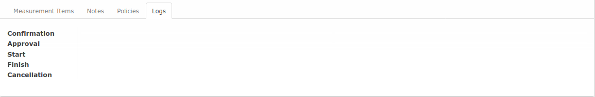

# Penjelasan Partner Evaluation

Informasi pada Partner Evaluation dibagi menjadi beberapa area, diantaranya:

* [A. Header](#bagian-header)
* [B. Tab Measurement Items](#tab-measurement-items)
* [C. Tab Notes](#tab-notes)
* [D. Tab Policies](#tab-policies)
* [E. Tab Logs](#tab-logs)

### <a name="bagian-header">A. HEADER</a>

#### <a name="field-document"># Document</a>

Nomor dokumen

#### <a name="field-template">Template</a>

Template evaluasi. Tiap template memiliki set pertanyaan yang berbeda-beda. Tiap template juga mempunyai kategorisasi hasil evaluasi yang berbeda.

#### <a name="field-partner">Partner</a>

Partner yang dievaluasi.

#### <a name="field-responsible">Responsible</a>

User yang bertanggung jawab untuk melakukan evaluasi.

#### <a name="field-date-start">Date Start</a>

Tanggal mulai data partner dievaluasi. Tiap template dapat diset apakah mengharuskan untuk pengisian Date Start dan Date End. Contoh: Evaluasi bulanan pembelian supplier diharuskan untuk mengisi tanggal mulai (Date Start) dan tanggal akhir (Date End) untuk memilih data pembelian yang menjadi dasar evaluasi.

#### <a name="field-date-end">Date End</a>

Tanggal mulai data partner dievaluasi (lihat penjelasan **Date Start**).

#### <a name="field-result">Result</a>

Kategorisasi hasil evaluasi. Hasil evaluasi dapat (1) dipilih manual, atau (2) dikomputasi otomatis berdasarkan perhitungan tertentu. Lihat langkah kerja **Menyelesaikan Partner Evaluation**.

#### <a name="field-schedule-date-start">Evaluation Schedule Date Start</a>

Tanggal estimasi partner evaluation akan mulai dilakukan.

#### <a name="field-schedule-date-end">Evaluation Schedule Date End</a>

Tanggal estimasi partner evaluation akan selesai.

#### <a name="field-real-date-start">Real Date Start</a>

Tanggal mulai partner evaluation yang sesungguhnya.

#### <a name="field-real-date-end">Real Date End</a>

Tanggal akhir partner evaluation yang sesungguhnya.

### <a name="tab-measurement-items">B. TAB MEASUREMENT ITEMS</a>

### <a name="tab-measurement-items">B.1 TABEL MEASUREMENT ITEMS</a>

Tabel ini akan berisi kumpulan pertanyaan beserta jawaban dari partner evaluation.

#### <a name="field-item">Item</a>

Item evaluasi.

#### <a name="field-type">Type</a>

*Qualitative*: User diharuskan untuk memilih satu dari beberapa pilihan. *Quantitative*: User diharuskan untuk menginput jawaban berupa angka.

#### <a name="field-method">Method</a>

*Manual*: Jawaban harus diinput oleh user. *Automatic*: Jawaban akan dikomputasi secara otomatis berdasarkan data-data yang ada di dalam Odoo terkait dengan partner yang sedang dievaluasi.

#### <a name="field-answer">Answer</a>

Jawaban dari item yang dievaluasi.

### <a name="tab-notes">C. TAB NOTES</a>

#### <a name="field-note">Note</a>

Catatan tambahan terkait dengan partner evaluation.

### <a name="tab-policies">D. TAB POLICIES</a>

Tab ini akan berisi informasi readonly mengenai boleh/tidaknya user untuk menjalankan aksi tertentu terhadap data.

#### <a name="field-can-confirm">Can Confirm</a>

Apabila aktif maka user dapat mengkonfirmasi partner evaluation.

#### <a name="field-can-approve">Can Approve</a>

Apabila aktif maka user dapat menyetujui partner evaluation.

#### <a name="field-can-start">Can Start</a>

Apabila aktif maka user dapat memulai partner evaluation.

#### <a name="field-can-finish">Can Finish</a>

Apabila aktif maka user dapat menyelesaikan partner evaluation.

#### <a name="field-can-cancel">Can Cancel</a>

Apabila aktif maka user dapat membatalkan partner evaluation.

#### <a name="field-can-restart">Can Restart</a>

Apabila aktif maka user dapat merestart partner evaluation.

### <a name="tab-logs">E. TAB LOGS</a>

#### <a name="field-confirmation">Confirmation</a>

User yang mengkonfirmasi partner evaluation dan waktu konfirmasi partner evaluation.

#### <a name="field-approval">Approval</a>

User yang menyetujui partner evaluation dan waktu disetujuinya partner evaluation.

#### <a name="field-start">Start</a>

User yang memulai partner evaluation dan waktu dimulainya partner evaluation.

#### <a name="field-finish">Finish</a>

User yang meyelesaikan partner evaluation dan waktu diselesaikannya partner evaluation.

#### <a name="field-cancellation">Cancellation</a>

User yang membatalkan partner evaluation dan waktu dibatalkannya partner evaluation.
