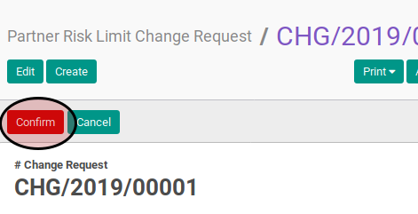

# Mengkonfirmasi Risk Limit Change Request

## A. INPUT

* Data risk limit change request yang akan dikonfirmasi harus memiliki status **Draft**.

* User yang mengkonfirmasi harus memiliki akses untuk mengkonfirmasi risk limit change request.

## B. INSTRUKSI KERJA

1. Buka menu **Partner -> Partner Risk -> Risk Limit Change Request**. Abaikan jika sudah berada pada menu yang dimaksud.
2. Buka data risk limit change request yang akan dikonfirmasi. Abaikan jika data sudah dibuka.
3. Klik tombol **Confirm** pada bagian atas-kiri form.

## C. OUTPUT

* Status risk limit change request akan berubah menjadi **Waiting for Approval**.

* Data risk limit change request tidak dapat dimodifikasi.
