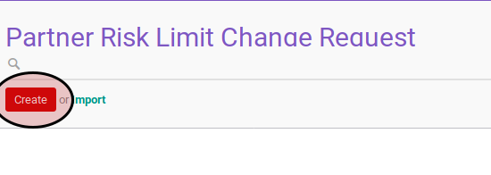
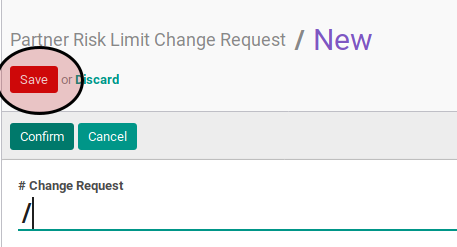

# Membuat Risk Limit Change Request

## A. INPUT

*(Tidak ada instruksi khusus)*

## B. INSTRUKSI KERJA

1. Buka menu **Partner -> Partner Risk -> Risk Limit Change Request**. Abaikan jika sudah berada pada menu yang dimaksud.
2. Klik tombol **Create** pada bagian atas-kiri form

3. Ubah **# Change Request** jika diperlukan. Harus diisi.
4. Pilih **Customer**. Harus diisi.
5. Isi **Total Risk Limit**. Biarkan 0.0 jika tidak ada perubahan
6. Isi **Draft Invoice Risk Limit**. Biarkan 0.0 jika tidak ada perubahan
7. Isi **Open Invoice Risk Limit**. Biarkan 0.0 jika tidak ada perubahan
8. Isi **Unpaid Invoice Adjustment**. Biarkan 0.0 jika tidak ada perubahan
9. Isi **Account Amount Risk Limit**. Biarkan 0.0 jika tidak ada perubahan
10. Isi **Sale Order Risk**. Biarkan 0.0 jika tidak ada perubahan
11. Isi **Single Sale Order Risk**. Biarkan 0.0 jika tidak ada perubahan
12. Buka tab **Reason**.
13. Isi **Reason**. Harus diisi.
14. Klik tombol **Save** pada bagian atas-kiri form.

## C. OUTPUT

* Data risk limit change request akan terbuat dengan status **Draft**.

