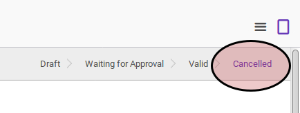
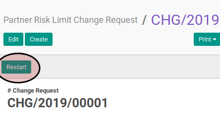
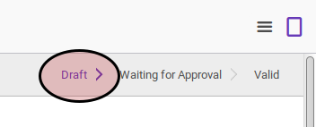

# Merestart Risk Limit Change Request

## A. INPUT

* Data risk limit change request yang akan direstart harus memiliki status **Cancelled**.

* User yang merestart harus memiliki akses untuk merestart risk limit change request.

## B. INSTRUKSI KERJA

1. Buka menu **Partner -> Partner Risk -> Risk Limit Change Request**. Abaikan jika sudah berada pada menu yang dimaksud.
2. Buka data risk limit change request yang akan direstart. Abaikan jika data sudah dibuka.
3. Klik tombol **Restart** pada bagian atas-kiri form.

## C. OUTPUT

* Status risk limit change request akan berubah menjadi **Draft**.

* Data risk limit change request kembali dapat dimodifikasi.
