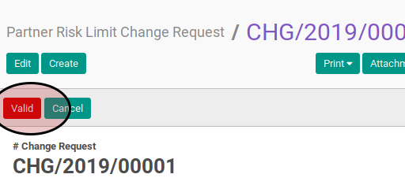
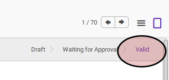

# Memvalidasi Risk Limit Change Request

## A. INPUT

* Data risk limit change request yang akan divalidasi harus memiliki status **Waiting for Approval**.

* User yang memvalidasi harus memiliki akses untuk memvalidasi risk limit change request.
* User yang memvalidasi harus memiliki kewenangan untuk merubah limit sebesar yang akan divalidasi.

## B. INSTRUKSI KERJA

1. Buka menu **Partner -> Partner Risk -> Risk Limit Change Request**. Abaikan jika sudah berada pada menu yang dimaksud.
2. Buka data risk limit change request yang akan divalidasi. Abaikan jika data sudah dibuka.
3. Klik tombol **Valid** pada bagian atas-kiri form.

## C. OUTPUT

* Status risk limit change request akan berubah menjadi **Valid**.

* Risk limit partner akan berubah sesuai dengan nilai perubahan yang tidak bernilai 0.0
